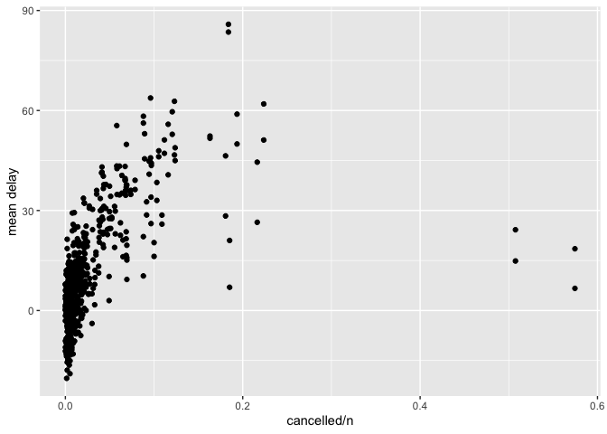

HW2
================
William Haznaw
9/21/2021

``` r
library(dplyr)
```

    ## 
    ## Attaching package: 'dplyr'

    ## The following objects are masked from 'package:stats':
    ## 
    ##     filter, lag

    ## The following objects are masked from 'package:base':
    ## 
    ##     intersect, setdiff, setequal, union

``` r
# install.packages("nycflights13")
library(nycflights13)
library(ggplot2)
library(lubridate)
```

    ## 
    ## Attaching package: 'lubridate'

    ## The following objects are masked from 'package:base':
    ## 
    ##     date, intersect, setdiff, union

1.  Find all flights that:
    
    Had an arrival delay of two or more hours
    
    Flew to Houston (IAH or HOU)
    
    Were operated by United, American, or Delta
    
    Departed in summer (July, August, and September)
    
    Arrived more than two hours late, but didn’t leave late
    
    Were delayed by at least an hour, but made up over 30 minutes in
    flight
    
    Departed between midnight and 6am (inclusive)

#### 1.1

``` r
filter(flights, arr_delay >= 120)
```

    ## # A tibble: 10,200 x 19
    ##     year month   day dep_time sched_dep_time dep_delay arr_time sched_arr_time
    ##    <int> <int> <int>    <int>          <int>     <dbl>    <int>          <int>
    ##  1  2013     1     1      811            630       101     1047            830
    ##  2  2013     1     1      848           1835       853     1001           1950
    ##  3  2013     1     1      957            733       144     1056            853
    ##  4  2013     1     1     1114            900       134     1447           1222
    ##  5  2013     1     1     1505           1310       115     1638           1431
    ##  6  2013     1     1     1525           1340       105     1831           1626
    ##  7  2013     1     1     1549           1445        64     1912           1656
    ##  8  2013     1     1     1558           1359       119     1718           1515
    ##  9  2013     1     1     1732           1630        62     2028           1825
    ## 10  2013     1     1     1803           1620       103     2008           1750
    ## # … with 10,190 more rows, and 11 more variables: arr_delay <dbl>,
    ## #   carrier <chr>, flight <int>, tailnum <chr>, origin <chr>, dest <chr>,
    ## #   air_time <dbl>, distance <dbl>, hour <dbl>, minute <dbl>, time_hour <dttm>

#### 1.4

``` r
filter(flights, dest == "IAH" | dest == "HOU")
```

    ## # A tibble: 9,313 x 19
    ##     year month   day dep_time sched_dep_time dep_delay arr_time sched_arr_time
    ##    <int> <int> <int>    <int>          <int>     <dbl>    <int>          <int>
    ##  1  2013     1     1      517            515         2      830            819
    ##  2  2013     1     1      533            529         4      850            830
    ##  3  2013     1     1      623            627        -4      933            932
    ##  4  2013     1     1      728            732        -4     1041           1038
    ##  5  2013     1     1      739            739         0     1104           1038
    ##  6  2013     1     1      908            908         0     1228           1219
    ##  7  2013     1     1     1028           1026         2     1350           1339
    ##  8  2013     1     1     1044           1045        -1     1352           1351
    ##  9  2013     1     1     1114            900       134     1447           1222
    ## 10  2013     1     1     1205           1200         5     1503           1505
    ## # … with 9,303 more rows, and 11 more variables: arr_delay <dbl>,
    ## #   carrier <chr>, flight <int>, tailnum <chr>, origin <chr>, dest <chr>,
    ## #   air_time <dbl>, distance <dbl>, hour <dbl>, minute <dbl>, time_hour <dttm>

#### 1.6

``` r
filter(flights, 
       dep_delay >= 60, 
       dep_delay - arr_delay > 30 )
```

    ## # A tibble: 1,844 x 19
    ##     year month   day dep_time sched_dep_time dep_delay arr_time sched_arr_time
    ##    <int> <int> <int>    <int>          <int>     <dbl>    <int>          <int>
    ##  1  2013     1     1     2205           1720       285       46           2040
    ##  2  2013     1     1     2326           2130       116      131             18
    ##  3  2013     1     3     1503           1221       162     1803           1555
    ##  4  2013     1     3     1839           1700        99     2056           1950
    ##  5  2013     1     3     1850           1745        65     2148           2120
    ##  6  2013     1     3     1941           1759       102     2246           2139
    ##  7  2013     1     3     1950           1845        65     2228           2227
    ##  8  2013     1     3     2015           1915        60     2135           2111
    ##  9  2013     1     3     2257           2000       177       45           2224
    ## 10  2013     1     4     1917           1700       137     2135           1950
    ## # … with 1,834 more rows, and 11 more variables: arr_delay <dbl>,
    ## #   carrier <chr>, flight <int>, tailnum <chr>, origin <chr>, dest <chr>,
    ## #   air_time <dbl>, distance <dbl>, hour <dbl>, minute <dbl>, time_hour <dttm>

3.  How many flights have a missing dep\_time? What other variables are
    missing? What might these rows represent?

<!-- end list -->

``` r
cancelled_flights = filter(flights, is.na(dep_time))
head(cancelled_flights)
```

    ## # A tibble: 6 x 19
    ##    year month   day dep_time sched_dep_time dep_delay arr_time sched_arr_time
    ##   <int> <int> <int>    <int>          <int>     <dbl>    <int>          <int>
    ## 1  2013     1     1       NA           1630        NA       NA           1815
    ## 2  2013     1     1       NA           1935        NA       NA           2240
    ## 3  2013     1     1       NA           1500        NA       NA           1825
    ## 4  2013     1     1       NA            600        NA       NA            901
    ## 5  2013     1     2       NA           1540        NA       NA           1747
    ## 6  2013     1     2       NA           1620        NA       NA           1746
    ## # … with 11 more variables: arr_delay <dbl>, carrier <chr>, flight <int>,
    ## #   tailnum <chr>, origin <chr>, dest <chr>, air_time <dbl>, distance <dbl>,
    ## #   hour <dbl>, minute <dbl>, time_hour <dttm>

``` r
nrow(cancelled_flights)
```

    ## [1] 8255

Cancelled Flights.

2.  Currently dep\_time and sched\_dep\_time are convenient to look at,
    but hard to compute with because they’re not really continuous
    numbers. Convert them to a more convenient representation of number
    of minutes since midnight.

<!-- end list -->

``` r
flights <-flights %>% 
    mutate(dep_minutes_since_midnight = (dep_time %/%100)*60 + (dep_time%%100),
           arr_minutes_since_midnight = (arr_time %/%100)*60 + (arr_time%%100)) 


flights %>% 
    select(dep_minutes_since_midnight,arr_minutes_since_midnight)
```

    ## # A tibble: 336,776 x 2
    ##    dep_minutes_since_midnight arr_minutes_since_midnight
    ##                         <dbl>                      <dbl>
    ##  1                        317                        510
    ##  2                        333                        530
    ##  3                        342                        563
    ##  4                        344                        604
    ##  5                        354                        492
    ##  6                        354                        460
    ##  7                        355                        553
    ##  8                        357                        429
    ##  9                        357                        518
    ## 10                        358                        473
    ## # … with 336,766 more rows

Look at the number of canceled flights per day. Is there a pattern? Is
the proportion of canceled flights related to the average delay? Use
multiple dyplr operations, all on one line, concluding with
ggplot(aes(x= ,y=)) + geom\_point()

``` r
flights %>%
  mutate(dep_date = lubridate::make_datetime(year, month, day)) %>%
  group_by(dep_date) %>%
  summarise(cancelled = sum(is.na(dep_delay)), 
            n = n(),
            mean_dep_delay = mean(dep_delay,na.rm=TRUE),
            mean_arr_delay = mean(arr_delay,na.rm=TRUE)) %>%
    ggplot(aes(x= cancelled/n)) + 
    geom_point(aes(y=mean_dep_delay)) + 
    geom_point(aes(y=mean_arr_delay)) + 
    ylab('mean delay')
```

    ## `summarise()` ungrouping output (override with `.groups` argument)

<!-- -->
